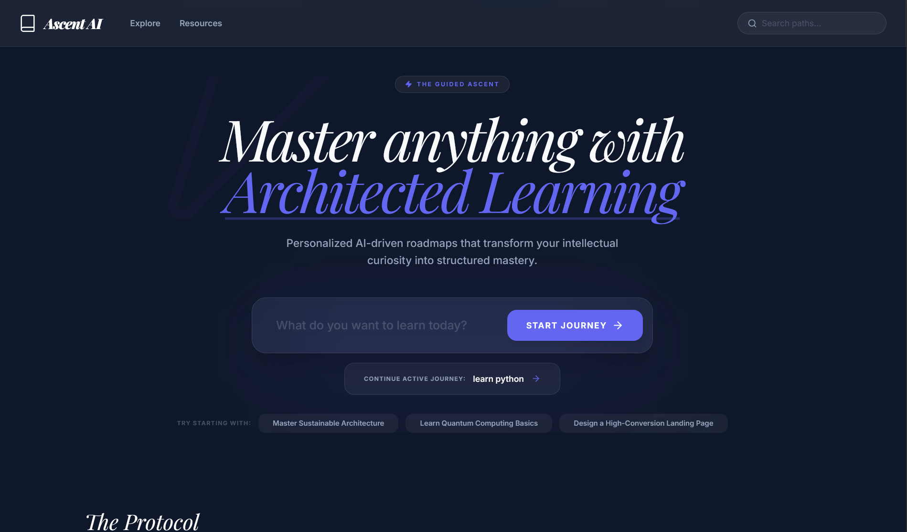
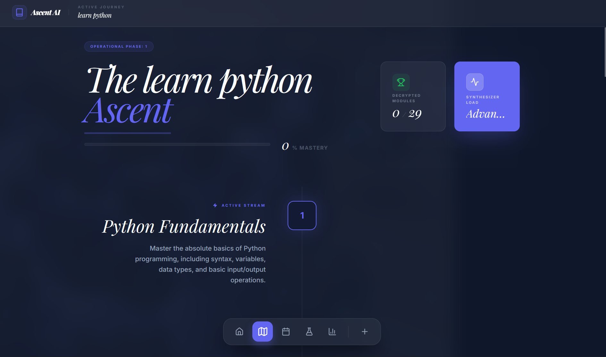
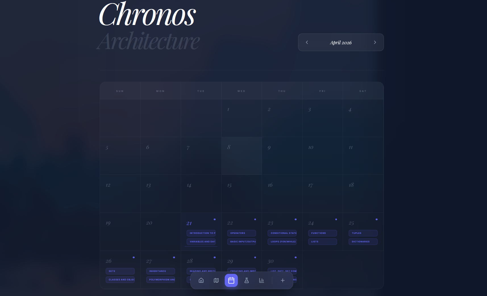
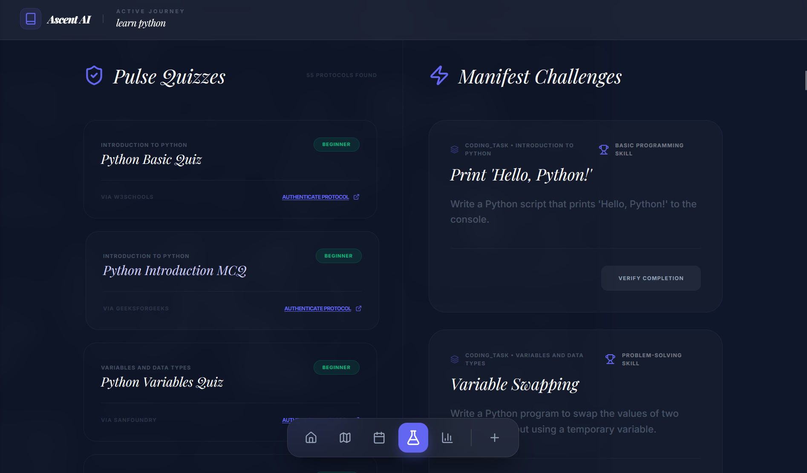
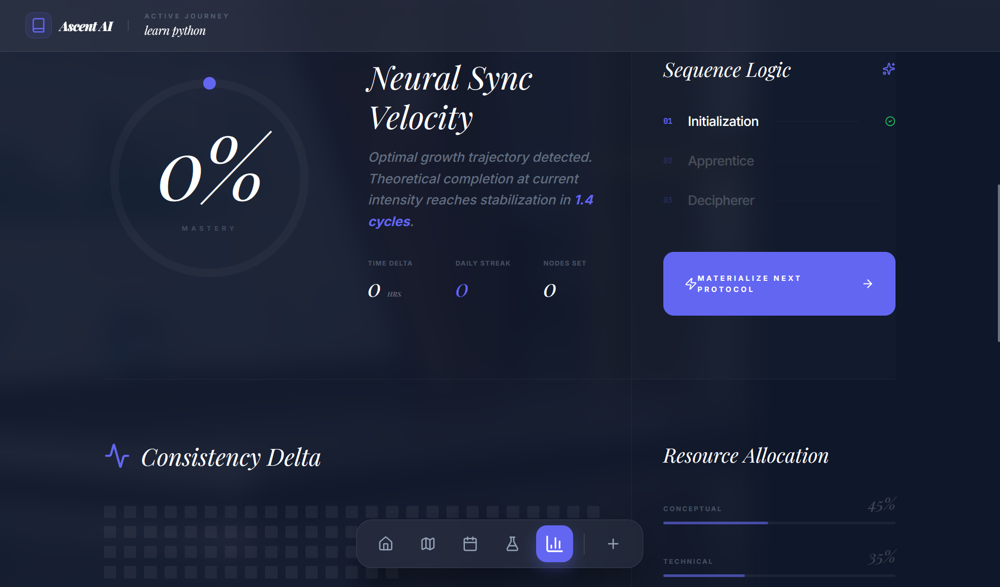

# 🌌 Ascent AI | The Intelligent Learning Architect

**Ascent AI** is a sophisticated, AI-driven learning orchestration platform designed to transform complex intellectual goals into structured, actionable mastery trajectories. By synthesizing high-density knowledge into intuitive, motion-enhanced mindmaps, Ascent AI empowers users to navigate the "Guided Ascent" from curiosity to expertise.



## 🏛️ Core Architecture

### 1. The Protocol Architect
Leveraging the power of **Google Gemini 2.0 Flash**, Ascent AI generates comprehensive learning roadmaps with deep dependency mapping. Every node is architected to ensure a logical progression from conceptual foundations to technical mastery.



### 2. Chronos Scheduling
The **Chronos Architecture** integrates your learning path into a high-performance calendar system, allowing you to visualize your commitment and manage your "Neural Sync" across days and weeks.



### 3. The Manifest & Pulse Hub
Verify your comprehension through the **Pulse Quiz** system and solidify your technical skills via **Manifest Challenges**. These modules are dynamically curated to match your specific roadmap nodes.



### 4. Neural Analytics
Monitor your growth velocity with the **Neural Sync Dashboard**. Track your consistency delta, calculate module decryption progress, and visualize your mastery percentage in real-time.



---

## 🛠️ Technical Specification

- **Core Engine**: React 19 + TypeScript
- **Bundler**: Vite 6
- **Styling Strategy**: Post-Modern CSS / Tailwind v4
- **Animation Layer**: Motion (Framermotion) v12
- **Intelligence Layer**: Google Generative AI (Gemini SDK)
- **Security**: "Bring Your Own Key" (BYOK) Client-Side Encryption for API credentials.

---

## 🚀 Deployment & Installation

### Local Protocol Initialization

1. **Clone the repository**:
   ```bash
   git clone https://github.com/NAVEED-FARHAN/Ascent-AI.git
   cd Ascent-AI
   ```

2. **Install Dependencies**:
   ```bash
   npm install
   ```

3. **Launch Environment**:
   ```bash
   npm run dev
   ```

### Live Synchronization (Render)
This project is optimized for deployment as a **Static Site** on Render.
- **Build Command**: `npm run build`
- **Publish Directory**: `dist`

---

Built with precision by [Naveed Farhan](https://github.com/NAVEED-FARHAN)
Project: **Ascent AI** | Status: **Operational**
